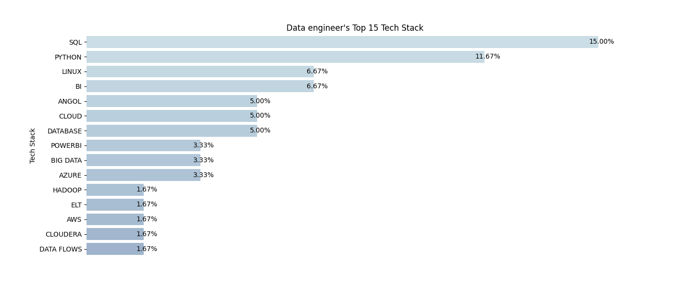
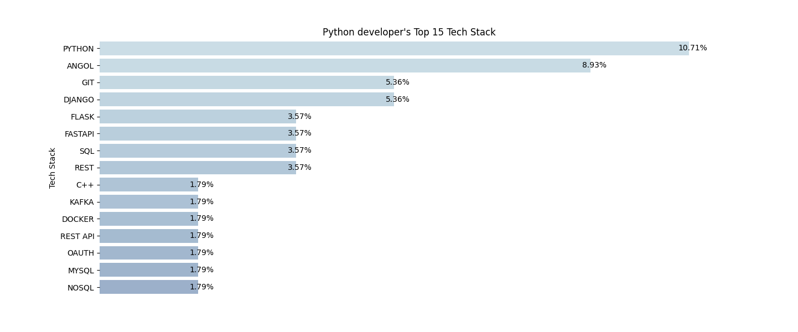

# Job Data Scraping and Analysis Package

This Python package provides a set of scripts for web scraping and analyzing job data from professional websites. The package allows you to gather job information based on predefined search criteria and analyze the technology stack requirements for the given job title in `config.py`. 

## Table of Contents
- [Package Overview](#package-overview)
- [Prerequisites](#prerequisites)
- [Usage](#usage)
- [License](#license)

## Package Overview

This package is designed to assist users in collecting job data from professional websites and gaining insights into the technology stack requirements for given job titles. It includes web scraping functionalities, data analysis, and data visualization.

For example for the search keywords "Data, engineer" given in `config.py`, the following result is created by this package:


For the search keywords "Python, developer" a different graph is generated:

## Prerequisites

Before using this package, please ensure you have the following dependencies installed:

- Python 3.x
- Required Python libraries: `pandas`, `sqlalchemy`, `matplotlib`, `seaborn`.

## Usage

Follow these steps to use the package:

1. **Setup**:
   - Clone or download the package to your local machine.
   - Configure a PostgreSQL database using the `DB_URI` variable in `main.py` and `analyze_data.py`. Replace placeholders with actual credentials.

2. **Configuration**:
   - Modify search criteria in the `config.py` file.
   - Set environment variables for website URLs using `PRF_URL` and `NOF_URL`, or replace URL placeholders in the scripts.

3. **Execution**:
   - Run the script in your terminal:
     ```
     python main.py
     ```
   - View detailed information in the generated log files.

4. **Visualization**:
   - The package will create an image representing the most common technology stack.


## License

MIT License with No Selling Clause - see `LICENSE.txt`