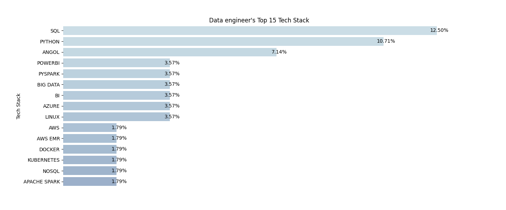
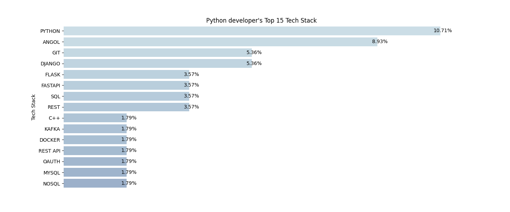

# Job Data Scraping and Analysis Package

This Python package provides a set of scripts for web scraping and analyzing job data from professional websites. The package allows you to gather job information based on predefined search criteria and analyze the technology stack requirements for the given job title in `config.py`. 

## Table of Contents
- [Package Overview](#package-overview)
- [Prerequisites](#prerequisites)
- [Usage](#usage)
- [Scripts Overview](#scripts-overview)
  - [main.py](#mainpy)
  - [analyze_data.py](#analyzedatapy)
- [Additional Scripts](#additional-scripts)
- [License](#license)

## Package Overview

This package is designed to assist users in collecting job data from professional websites and gaining insights into the technology stack requirements for given job titles. It includes web scraping functionalities, data analysis, and data visualization.

For example for the search keywords "Data, engineer" given in `config.py`, the following result is created by this package:


For the search keywords "Python, developer" a different graph is generated:

## Prerequisites

Before using this package, please ensure you have the following dependencies installed:

- Python 3.x
- Required Python libraries: `pandas`, `time`, `random`, `logging`, `os`, `json`, `sqlalchemy`, `matplotlib`, `seaborn`.

## Usage

Follow these steps to use the package:

1. Clone or download this package to your local machine.

2. Set up a PostgreSQL database with a configuration matching the `DB_URI` variable in both scripts (`main.py` and `analyze_data.py`). Replace the placeholders like `os.getenv('P4PASSWD')` with actual database credentials and host information.

3. Configure the search criteria by modifying the `search_kws` variable in the `config.py` file.

4. Set environment variables `PRF_URL` and `NOF_URL` to the URLs of the 'prf' and 'nof' websites, respectively, or replace `os.getenv("PRF_URL")` and `os.getenv("NOF_URL")` in the script with the actual URLs.

5. Run the script using the following commands in your terminal:

   ```
   python main.py
   ```

6. Review the output image and log files generated by the scripts for detailed information about the scraping process and data analysis.

## Scripts Overview

### main.py

The `main.py` script is the main web scraping component of the package and performs the following tasks:

- Scraping job information from two professional websites, 'prf' and 'nof', and storing it in a database and CSV file.
- Implementing rate limiting to ensure responsible scraping.
- Providing options to specify search criteria and customize the scraping behavior.

### analyze_data.py

The `analyze_data.py` script is responsible for analyzing and visualizing job data obtained from the professional websites. It performs the following tasks:

- Fetching job data from the database.
- Analyzing the job data, particularly the technology stack required for the jobs.
- Creating visualizations to show the most frequent technology stack requirements.
- Providing insights into the tech stack based on the job titles and other factors.


## License

This package is provided under an open-source license (if applicable). Please refer to the license file or the individual script headers for more information on the licensing terms and conditions.

These scripts and tools are intended to help users gather and analyze job data from professional websites, offering valuable insights into the technology stack requirements for given job titles. Feel free to customize and extend the package to suit your specific needs and requirements.